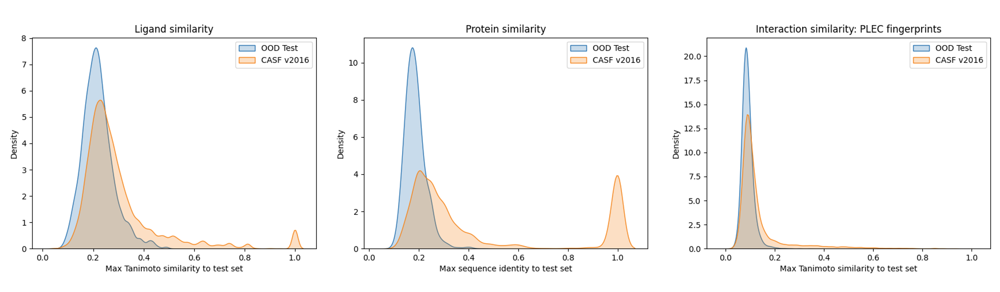

# OOD Test

Out-Of-Distribution Test (OOD Test) is a novel dataset split of PDBbind v2020, developed to minimise dataset leakage between the train and test sets. OOD Test was introduced in https://chemrxiv.org/engage/chemrxiv/article-details/6675a38d5101a2ffa8274f62

## Benchmark description

The split can be found in the "split" column of *index_oodtest.csv*. OOD Test has the following properties:

- Test set complexes are from the Refined set of PDBbind v2020.
- All ligands in the training data have less than 0.5 Tanimoto similarity to the test set ligands. Tanimoto similarity was calculated using ECFP6 fingerprints.
- All proteins in the training data have less than 50% sequence identity to test set proteins. Sequence identity was calculated with MMseqs2.
- The test set excludes heavy ligands (molecular weight > 1000 Da) and ligands with more than 20 rotatable bonds.
- There is no Pocket Pfam cluster overlap between the training and test datapoints. The Pocket Pfam clusters are defined by Zhu et al. in *Assessment of the Generalization Abilities of Machine-Learning Scoring Functions for Structure-Based Virtual Screening (JCIM, 2022)*.
- The test and training sets include 295 and 18,402 complexes respectively.

## Comparison with CASF-2016
Maximum similarity of training complexes to test complexes in CASF v2016 (orange) and OOD Test (blue), in terms of ligand Tanimoto similarity (left), protein sequence similarity (middle), and protein-ligand interaction similarity (right). We use Tanimoto similarity of PLEC fingerprints to estimate protein-ligand interaction similarity.

